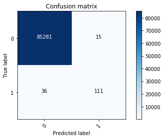
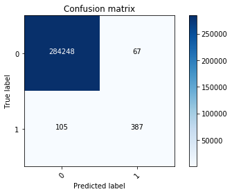
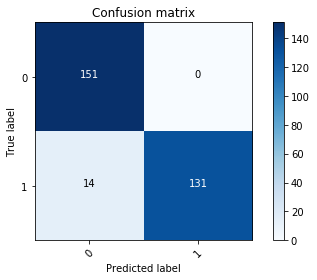
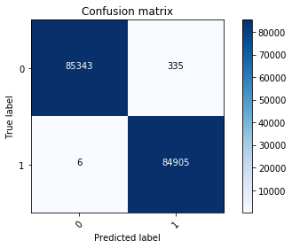

```python
import pandas as pd
import numpy as np
import keras

np.random.seed(2)
```

    Using TensorFlow backend.
    /Users/rodrigobeceiro/anaconda/lib/python3.6/importlib/_bootstrap.py:219: RuntimeWarning: compiletime version 3.5 of module 'tensorflow.python.framework.fast_tensor_util' does not match runtime version 3.6
      return f(*args, **kwds)


```python
data = pd.read_csv('creditcard.csv')
```

## Data exploration


```python
data.head()
```


<div>
<style>
    .dataframe thead tr:only-child th {
        text-align: right;
    }

    .dataframe thead th {
        text-align: left;
    }

    .dataframe tbody tr th {
        vertical-align: top;
    }
</style>
<table border="1" class="dataframe">
  <thead>
    <tr style="text-align: right;">
      <th></th>
      <th>Time</th>
      <th>V1</th>
      <th>V2</th>
      <th>V3</th>
      <th>V4</th>
      <th>V5</th>
      <th>V6</th>
      <th>V7</th>
      <th>V8</th>
      <th>V9</th>
      <th>...</th>
      <th>V21</th>
      <th>V22</th>
      <th>V23</th>
      <th>V24</th>
      <th>V25</th>
      <th>V26</th>
      <th>V27</th>
      <th>V28</th>
      <th>Amount</th>
      <th>Class</th>
    </tr>
  </thead>
  <tbody>
    <tr>
      <th>0</th>
      <td>0.0</td>
      <td>-1.359807</td>
      <td>-0.072781</td>
      <td>2.536347</td>
      <td>1.378155</td>
      <td>-0.338321</td>
      <td>0.462388</td>
      <td>0.239599</td>
      <td>0.098698</td>
      <td>0.363787</td>
      <td>...</td>
      <td>-0.018307</td>
      <td>0.277838</td>
      <td>-0.110474</td>
      <td>0.066928</td>
      <td>0.128539</td>
      <td>-0.189115</td>
      <td>0.133558</td>
      <td>-0.021053</td>
      <td>149.62</td>
      <td>0</td>
    </tr>
    <tr>
      <th>1</th>
      <td>0.0</td>
      <td>1.191857</td>
      <td>0.266151</td>
      <td>0.166480</td>
      <td>0.448154</td>
      <td>0.060018</td>
      <td>-0.082361</td>
      <td>-0.078803</td>
      <td>0.085102</td>
      <td>-0.255425</td>
      <td>...</td>
      <td>-0.225775</td>
      <td>-0.638672</td>
      <td>0.101288</td>
      <td>-0.339846</td>
      <td>0.167170</td>
      <td>0.125895</td>
      <td>-0.008983</td>
      <td>0.014724</td>
      <td>2.69</td>
      <td>0</td>
    </tr>
    <tr>
      <th>2</th>
      <td>1.0</td>
      <td>-1.358354</td>
      <td>-1.340163</td>
      <td>1.773209</td>
      <td>0.379780</td>
      <td>-0.503198</td>
      <td>1.800499</td>
      <td>0.791461</td>
      <td>0.247676</td>
      <td>-1.514654</td>
      <td>...</td>
      <td>0.247998</td>
      <td>0.771679</td>
      <td>0.909412</td>
      <td>-0.689281</td>
      <td>-0.327642</td>
      <td>-0.139097</td>
      <td>-0.055353</td>
      <td>-0.059752</td>
      <td>378.66</td>
      <td>0</td>
    </tr>
    <tr>
      <th>3</th>
      <td>1.0</td>
      <td>-0.966272</td>
      <td>-0.185226</td>
      <td>1.792993</td>
      <td>-0.863291</td>
      <td>-0.010309</td>
      <td>1.247203</td>
      <td>0.237609</td>
      <td>0.377436</td>
      <td>-1.387024</td>
      <td>...</td>
      <td>-0.108300</td>
      <td>0.005274</td>
      <td>-0.190321</td>
      <td>-1.175575</td>
      <td>0.647376</td>
      <td>-0.221929</td>
      <td>0.062723</td>
      <td>0.061458</td>
      <td>123.50</td>
      <td>0</td>
    </tr>
    <tr>
      <th>4</th>
      <td>2.0</td>
      <td>-1.158233</td>
      <td>0.877737</td>
      <td>1.548718</td>
      <td>0.403034</td>
      <td>-0.407193</td>
      <td>0.095921</td>
      <td>0.592941</td>
      <td>-0.270533</td>
      <td>0.817739</td>
      <td>...</td>
      <td>-0.009431</td>
      <td>0.798278</td>
      <td>-0.137458</td>
      <td>0.141267</td>
      <td>-0.206010</td>
      <td>0.502292</td>
      <td>0.219422</td>
      <td>0.215153</td>
      <td>69.99</td>
      <td>0</td>
    </tr>
  </tbody>
</table>
<p>5 rows × 31 columns</p>
</div>


## Pre-processing


```python
from sklearn.preprocessing import StandardScaler
data['normalizedAmount'] = StandardScaler().fit_transform(data['Amount'].values.reshape(-1,1)) #cambiamos el valor de 
                                                        #la columna Amount y la convertimos en valores entre -1 y 1
data = data.drop(['Amount'],axis=1)
```


```python
data.head()
```


<div>
<style>
    .dataframe thead tr:only-child th {
        text-align: right;
    }

    .dataframe thead th {
        text-align: left;
    }

    .dataframe tbody tr th {
        vertical-align: top;
    }
</style>
<table border="1" class="dataframe">
  <thead>
    <tr style="text-align: right;">
      <th></th>
      <th>Time</th>
      <th>V1</th>
      <th>V2</th>
      <th>V3</th>
      <th>V4</th>
      <th>V5</th>
      <th>V6</th>
      <th>V7</th>
      <th>V8</th>
      <th>V9</th>
      <th>...</th>
      <th>V21</th>
      <th>V22</th>
      <th>V23</th>
      <th>V24</th>
      <th>V25</th>
      <th>V26</th>
      <th>V27</th>
      <th>V28</th>
      <th>Class</th>
      <th>normalizedAmount</th>
    </tr>
  </thead>
  <tbody>
    <tr>
      <th>0</th>
      <td>0.0</td>
      <td>-1.359807</td>
      <td>-0.072781</td>
      <td>2.536347</td>
      <td>1.378155</td>
      <td>-0.338321</td>
      <td>0.462388</td>
      <td>0.239599</td>
      <td>0.098698</td>
      <td>0.363787</td>
      <td>...</td>
      <td>-0.018307</td>
      <td>0.277838</td>
      <td>-0.110474</td>
      <td>0.066928</td>
      <td>0.128539</td>
      <td>-0.189115</td>
      <td>0.133558</td>
      <td>-0.021053</td>
      <td>0</td>
      <td>0.244964</td>
    </tr>
    <tr>
      <th>1</th>
      <td>0.0</td>
      <td>1.191857</td>
      <td>0.266151</td>
      <td>0.166480</td>
      <td>0.448154</td>
      <td>0.060018</td>
      <td>-0.082361</td>
      <td>-0.078803</td>
      <td>0.085102</td>
      <td>-0.255425</td>
      <td>...</td>
      <td>-0.225775</td>
      <td>-0.638672</td>
      <td>0.101288</td>
      <td>-0.339846</td>
      <td>0.167170</td>
      <td>0.125895</td>
      <td>-0.008983</td>
      <td>0.014724</td>
      <td>0</td>
      <td>-0.342475</td>
    </tr>
    <tr>
      <th>2</th>
      <td>1.0</td>
      <td>-1.358354</td>
      <td>-1.340163</td>
      <td>1.773209</td>
      <td>0.379780</td>
      <td>-0.503198</td>
      <td>1.800499</td>
      <td>0.791461</td>
      <td>0.247676</td>
      <td>-1.514654</td>
      <td>...</td>
      <td>0.247998</td>
      <td>0.771679</td>
      <td>0.909412</td>
      <td>-0.689281</td>
      <td>-0.327642</td>
      <td>-0.139097</td>
      <td>-0.055353</td>
      <td>-0.059752</td>
      <td>0</td>
      <td>1.160686</td>
    </tr>
    <tr>
      <th>3</th>
      <td>1.0</td>
      <td>-0.966272</td>
      <td>-0.185226</td>
      <td>1.792993</td>
      <td>-0.863291</td>
      <td>-0.010309</td>
      <td>1.247203</td>
      <td>0.237609</td>
      <td>0.377436</td>
      <td>-1.387024</td>
      <td>...</td>
      <td>-0.108300</td>
      <td>0.005274</td>
      <td>-0.190321</td>
      <td>-1.175575</td>
      <td>0.647376</td>
      <td>-0.221929</td>
      <td>0.062723</td>
      <td>0.061458</td>
      <td>0</td>
      <td>0.140534</td>
    </tr>
    <tr>
      <th>4</th>
      <td>2.0</td>
      <td>-1.158233</td>
      <td>0.877737</td>
      <td>1.548718</td>
      <td>0.403034</td>
      <td>-0.407193</td>
      <td>0.095921</td>
      <td>0.592941</td>
      <td>-0.270533</td>
      <td>0.817739</td>
      <td>...</td>
      <td>-0.009431</td>
      <td>0.798278</td>
      <td>-0.137458</td>
      <td>0.141267</td>
      <td>-0.206010</td>
      <td>0.502292</td>
      <td>0.219422</td>
      <td>0.215153</td>
      <td>0</td>
      <td>-0.073403</td>
    </tr>
  </tbody>
</table>
<p>5 rows × 31 columns</p>
</div>


```python
data = data.drop(['Time'],axis=1) #eliminamos la columna Time
data.head()
```


<div>
<style>
    .dataframe thead tr:only-child th {
        text-align: right;
    }

    .dataframe thead th {
        text-align: left;
    }

    .dataframe tbody tr th {
        vertical-align: top;
    }
</style>
<table border="1" class="dataframe">
  <thead>
    <tr style="text-align: right;">
      <th></th>
      <th>V1</th>
      <th>V2</th>
      <th>V3</th>
      <th>V4</th>
      <th>V5</th>
      <th>V6</th>
      <th>V7</th>
      <th>V8</th>
      <th>V9</th>
      <th>V10</th>
      <th>...</th>
      <th>V21</th>
      <th>V22</th>
      <th>V23</th>
      <th>V24</th>
      <th>V25</th>
      <th>V26</th>
      <th>V27</th>
      <th>V28</th>
      <th>Class</th>
      <th>normalizedAmount</th>
    </tr>
  </thead>
  <tbody>
    <tr>
      <th>0</th>
      <td>-1.359807</td>
      <td>-0.072781</td>
      <td>2.536347</td>
      <td>1.378155</td>
      <td>-0.338321</td>
      <td>0.462388</td>
      <td>0.239599</td>
      <td>0.098698</td>
      <td>0.363787</td>
      <td>0.090794</td>
      <td>...</td>
      <td>-0.018307</td>
      <td>0.277838</td>
      <td>-0.110474</td>
      <td>0.066928</td>
      <td>0.128539</td>
      <td>-0.189115</td>
      <td>0.133558</td>
      <td>-0.021053</td>
      <td>0</td>
      <td>0.244964</td>
    </tr>
    <tr>
      <th>1</th>
      <td>1.191857</td>
      <td>0.266151</td>
      <td>0.166480</td>
      <td>0.448154</td>
      <td>0.060018</td>
      <td>-0.082361</td>
      <td>-0.078803</td>
      <td>0.085102</td>
      <td>-0.255425</td>
      <td>-0.166974</td>
      <td>...</td>
      <td>-0.225775</td>
      <td>-0.638672</td>
      <td>0.101288</td>
      <td>-0.339846</td>
      <td>0.167170</td>
      <td>0.125895</td>
      <td>-0.008983</td>
      <td>0.014724</td>
      <td>0</td>
      <td>-0.342475</td>
    </tr>
    <tr>
      <th>2</th>
      <td>-1.358354</td>
      <td>-1.340163</td>
      <td>1.773209</td>
      <td>0.379780</td>
      <td>-0.503198</td>
      <td>1.800499</td>
      <td>0.791461</td>
      <td>0.247676</td>
      <td>-1.514654</td>
      <td>0.207643</td>
      <td>...</td>
      <td>0.247998</td>
      <td>0.771679</td>
      <td>0.909412</td>
      <td>-0.689281</td>
      <td>-0.327642</td>
      <td>-0.139097</td>
      <td>-0.055353</td>
      <td>-0.059752</td>
      <td>0</td>
      <td>1.160686</td>
    </tr>
    <tr>
      <th>3</th>
      <td>-0.966272</td>
      <td>-0.185226</td>
      <td>1.792993</td>
      <td>-0.863291</td>
      <td>-0.010309</td>
      <td>1.247203</td>
      <td>0.237609</td>
      <td>0.377436</td>
      <td>-1.387024</td>
      <td>-0.054952</td>
      <td>...</td>
      <td>-0.108300</td>
      <td>0.005274</td>
      <td>-0.190321</td>
      <td>-1.175575</td>
      <td>0.647376</td>
      <td>-0.221929</td>
      <td>0.062723</td>
      <td>0.061458</td>
      <td>0</td>
      <td>0.140534</td>
    </tr>
    <tr>
      <th>4</th>
      <td>-1.158233</td>
      <td>0.877737</td>
      <td>1.548718</td>
      <td>0.403034</td>
      <td>-0.407193</td>
      <td>0.095921</td>
      <td>0.592941</td>
      <td>-0.270533</td>
      <td>0.817739</td>
      <td>0.753074</td>
      <td>...</td>
      <td>-0.009431</td>
      <td>0.798278</td>
      <td>-0.137458</td>
      <td>0.141267</td>
      <td>-0.206010</td>
      <td>0.502292</td>
      <td>0.219422</td>
      <td>0.215153</td>
      <td>0</td>
      <td>-0.073403</td>
    </tr>
  </tbody>
</table>
<p>5 rows × 30 columns</p>
</div>


```python
X = data.iloc[:, data.columns != 'Class'] # la X son todas las columnas del dataset excepto la columna Class
y = data.iloc[:, data.columns == 'Class'] # la y es sola la columna Class
```


```python
y.head()
```


<div>
<style>
    .dataframe thead tr:only-child th {
        text-align: right;
    }

    .dataframe thead th {
        text-align: left;
    }

    .dataframe tbody tr th {
        vertical-align: top;
    }
</style>
<table border="1" class="dataframe">
  <thead>
    <tr style="text-align: right;">
      <th></th>
      <th>Class</th>
    </tr>
  </thead>
  <tbody>
    <tr>
      <th>0</th>
      <td>0</td>
    </tr>
    <tr>
      <th>1</th>
      <td>0</td>
    </tr>
    <tr>
      <th>2</th>
      <td>0</td>
    </tr>
    <tr>
      <th>3</th>
      <td>0</td>
    </tr>
    <tr>
      <th>4</th>
      <td>0</td>
    </tr>
  </tbody>
</table>
</div>


```python
from sklearn.model_selection import train_test_split
X_train, X_test, y_train, y_test = train_test_split(X,y, test_size = 0.3, random_state=0)
```


```python
X_train.shape
```


    (199364, 29)


```python
X_test.shape
```


    (85443, 29)


```python
X_train = np.array(X_train) # transform our dataset into np.arrays
X_test = np.array(X_test)
y_train = np.array(y_train)
y_test = np.array(y_test)
```

## Deep neural network


```python
from keras.models import Sequential
from keras.layers import Dense
from keras.layers import Dropout
```


```python
model = Sequential([
    Dense(units=16, input_dim = 29,activation='relu'), # input dimensions have to be the same as our columns in dataset
    Dense(units=24,activation='relu'),
    Dropout(0.5),
    Dense(20,activation='relu'),
    Dense(24,activation='relu'),
    Dense(1,activation='sigmoid'), # the last activation is sigmoid because we are doing a binary classification problem
])
```


```python
model.summary()
```

    _________________________________________________________________
    Layer (type)                 Output Shape              Param #   
    =================================================================
    dense_1 (Dense)              (None, 16)                480       
    _________________________________________________________________
    dense_2 (Dense)              (None, 24)                408       
    _________________________________________________________________
    dropout_1 (Dropout)          (None, 24)                0         
    _________________________________________________________________
    dense_3 (Dense)              (None, 20)                500       
    _________________________________________________________________
    dense_4 (Dense)              (None, 24)                504       
    _________________________________________________________________
    dense_5 (Dense)              (None, 1)                 25        
    =================================================================
    Total params: 1,917
    Trainable params: 1,917
    Non-trainable params: 0
    _________________________________________________________________


## Training


```python
model.compile(optimizer='adam',loss='binary_crossentropy',metrics=['accuracy'])
model.fit(X_train,y_train,batch_size=15,epochs=5)
```

    Epoch 1/5
    199364/199364 [==============================] - 27s 136us/step - loss: 0.0100 - acc: 0.9979
    Epoch 2/5
    199364/199364 [==============================] - 33s 167us/step - loss: 0.0040 - acc: 0.9993
    Epoch 3/5
    199364/199364 [==============================] - 34s 173us/step - loss: 0.0038 - acc: 0.9994
    Epoch 4/5
    199364/199364 [==============================] - 32s 163us/step - loss: 0.0035 - acc: 0.9994
    Epoch 5/5
    199364/199364 [==============================] - 33s 165us/step - loss: 0.0034 - acc: 0.9994


    <keras.callbacks.History at 0x11d417358>


```python
score = model.evaluate(X_test, y_test)
```

    85443/85443 [==============================] - 4s 42us/step


```python
print(score) # means we have a 99,94 % accuracy
```

    [0.004728495871635026, 0.9993914071369217]


```python
import matplotlib.pyplot as plt
import itertools

from sklearn import svm, datasets
from sklearn.metrics import confusion_matrix

def plot_confusion_matrix(cm, classes,
                          normalize=False,
                          title='Confusion matrix',
                          cmap=plt.cm.Blues):
    """
    This function prints and plots the confusion matrix.
    Normalization can be applied by setting `normalize=True`.
    """
    if normalize:
        cm = cm.astype('float') / cm.sum(axis=1)[:, np.newaxis]
        print("Normalized confusion matrix")
    else:
        print('Confusion matrix, without normalization')

    print(cm)

    plt.imshow(cm, interpolation='nearest', cmap=cmap)
    plt.title(title)
    plt.colorbar()
    tick_marks = np.arange(len(classes))
    plt.xticks(tick_marks, classes, rotation=45)
    plt.yticks(tick_marks, classes)

    fmt = '.2f' if normalize else 'd'
    thresh = cm.max() / 2.
    for i, j in itertools.product(range(cm.shape[0]), range(cm.shape[1])):
        plt.text(j, i, format(cm[i, j], fmt),
                 horizontalalignment="center",
                 color="white" if cm[i, j] > thresh else "black")

    plt.ylabel('True label')
    plt.xlabel('Predicted label')
    plt.tight_layout()
```


```python
y_pred = model.predict(X_test)
y_test = pd.DataFrame(y_test)
```


```python
cnf_matrix = confusion_matrix(y_test, y_pred.round())
```


```python
print(cnf_matrix)
```

    [[85281    15]
     [   36   111]]


```python
plot_confusion_matrix(cnf_matrix, classes=[0,1])
```

    Confusion matrix, without normalization
    [[85281    15]
     [   36   111]]


```python
plt.show()
```





```python
y_pred = model.predict(X) # let's see the confusion matrix but for all our data, not only for X_test and y_test
y_expected = pd.DataFrame(y)
cnf_matrix = confusion_matrix(y_expected, y_pred.round())
plot_confusion_matrix(cnf_matrix,classes=[0,1])
plt.show()
```

    Confusion matrix, without normalization
    [[284248     67]
     [   105    387]]





## Undersampling


```python
fraud_indices = np.array(data[data.Class == 1].index) # locating our fraudulent locations in our dataset
number_records_fraud = len(fraud_indices) # counting how many fraudulent transactions we have
print(number_records_fraud)
```

    492


```python
normal_indices = data[data.Class == 0].index # we do the same but for non fraudulent transactions
```


```python
# now, from the nonfraudulent indexes, we just select random sample matching the same amount of fraudulent transactions
# that we have
random_normal_indices = np.random.choice(normal_indices, number_records_fraud, replace=False)
random_normal_indices = np.array(random_normal_indices) # we transform in np.array
print(len(random_normal_indices))
```

    492


```python
# we create a new array with all the indexes of fraudulent and nonfraudulent transactions just concatinating both indexes
under_sample_indices = np.concatenate([fraud_indices,random_normal_indices])
print(len(under_sample_indices))
```

    984


```python
under_sample_data = data.iloc[under_sample_indices,:] # now we just select the corresponding rows
```


```python
X_undersample = under_sample_data.iloc[:,under_sample_data.columns != 'Class']
y_undersample = under_sample_data.iloc[:,under_sample_data.columns == 'Class']
```


```python
X_train, X_test, y_train, y_test = train_test_split(X_undersample,y_undersample, test_size=0.3)
```


```python
X_train = np.array(X_train)
X_test = np.array(X_test)
y_train = np.array(y_train)
y_test = np.array(y_test)
```


```python
model.summary()
```

    _________________________________________________________________
    Layer (type)                 Output Shape              Param #   
    =================================================================
    dense_1 (Dense)              (None, 16)                480       
    _________________________________________________________________
    dense_2 (Dense)              (None, 24)                408       
    _________________________________________________________________
    dropout_1 (Dropout)          (None, 24)                0         
    _________________________________________________________________
    dense_3 (Dense)              (None, 20)                500       
    _________________________________________________________________
    dense_4 (Dense)              (None, 24)                504       
    _________________________________________________________________
    dense_5 (Dense)              (None, 1)                 25        
    =================================================================
    Total params: 1,917
    Trainable params: 1,917
    Non-trainable params: 0
    _________________________________________________________________


```python
model.compile(optimizer='adam',loss='binary_crossentropy',metrics=['accuracy'])
model.fit(X_train,y_train,batch_size=15,epochs=5)
```

    Epoch 1/5
    688/688 [==============================] - 1s 933us/step - loss: 0.6047 - acc: 0.9026
    Epoch 2/5
    688/688 [==============================] - 0s 163us/step - loss: 0.2955 - acc: 0.9070
    Epoch 3/5
    688/688 [==============================] - 0s 173us/step - loss: 0.2184 - acc: 0.9113
    Epoch 4/5
    688/688 [==============================] - 0s 178us/step - loss: 0.1792 - acc: 0.9302
    Epoch 5/5
    688/688 [==============================] - 0s 170us/step - loss: 0.1637 - acc: 0.9346


    <keras.callbacks.History at 0x11f5e3470>


```python
y_pred = model.predict(X_test)
y_expected = pd.DataFrame(y_test)
cnf_matrix = confusion_matrix(y_expected, y_pred.round())
plot_confusion_matrix(cnf_matrix, classes=[0,1])
plt.show()
```

    Confusion matrix, without normalization
    [[151   0]
     [ 14 131]]





```python
y_pred = model.predict(X)
y_expected = pd.DataFrame(y)
cnf_matrix = confusion_matrix(y_expected, y_pred.round())
plot_confusion_matrix(cnf_matrix, classes=[0,1])
plt.show()
```

    Confusion matrix, without normalization
    [[283816    499]
     [    55    437]]


## SMOTE


```bash
%%bash
pip install -U imbalanced-learn
```

    Collecting imbalanced-learn
      Downloading https://files.pythonhosted.org/packages/ff/da/6a37e9fc0deccc07c8b2d42344722dbce85553e9e64aa6e3ac7a1e8c4a2f/imbalanced_learn-0.4.1-py3-none-any.whl (166kB)
    Collecting scikit-learn>=0.20 (from imbalanced-learn)
      Downloading https://files.pythonhosted.org/packages/72/c8/7a449014b506d4fed3d7fef5b86c0210ff882a13da82626a12ce9f7db616/scikit_learn-0.20.0-cp36-cp36m-macosx_10_6_intel.macosx_10_9_intel.macosx_10_9_x86_64.macosx_10_10_intel.macosx_10_10_x86_64.whl (7.8MB)
    Requirement already satisfied, skipping upgrade: numpy>=1.8.2 in /Users/rodrigobeceiro/anaconda/lib/python3.6/site-packages (from imbalanced-learn) (1.14.2)
    Requirement already satisfied, skipping upgrade: scipy>=0.13.3 in /Users/rodrigobeceiro/anaconda/lib/python3.6/site-packages (from imbalanced-learn) (1.0.1)
    Installing collected packages: scikit-learn, imbalanced-learn
      Found existing installation: scikit-learn 0.19.1
        Uninstalling scikit-learn-0.19.1:
          Successfully uninstalled scikit-learn-0.19.1
      Found existing installation: imbalanced-learn 0.3.3
        Uninstalling imbalanced-learn-0.3.3:
          Successfully uninstalled imbalanced-learn-0.3.3
    Successfully installed imbalanced-learn-0.4.1 scikit-learn-0.20.0


    You are using pip version 18.0, however version 18.1 is available.
    You should consider upgrading via the 'pip install --upgrade pip' command.


```python
from imblearn.over_sampling import SMOTE
```


```python
X_resample, y_resample = SMOTE().fit_sample(X,y.values.ravel())
```


```python
y_resample = pd.DataFrame(y_resample)
X_resample = pd.DataFrame(X_resample)
```


```python
X_train, X_test, y_train, y_test = train_test_split(X_resample,y_resample,test_size=0.3)
```


```python
X_train = np.array(X_train)
X_test = np.array(X_test)
y_train = np.array(y_train)
y_test = np.array(y_test)
```


```python
model.compile(optimizer='adam',loss='binary_crossentropy',metrics=['accuracy'])
model.fit(X_train,y_train,batch_size=15,epochs=5)
```

    Epoch 1/5
    398041/398041 [==============================] - 69s 173us/step - loss: 0.0336 - acc: 0.9886
    Epoch 2/5
    398041/398041 [==============================] - 63s 158us/step - loss: 0.0123 - acc: 0.9968
    Epoch 3/5
    398041/398041 [==============================] - 63s 159us/step - loss: 0.0101 - acc: 0.9976
    Epoch 4/5
    398041/398041 [==============================] - 63s 158us/step - loss: 0.0090 - acc: 0.9979
    Epoch 5/5
    398041/398041 [==============================] - 64s 162us/step - loss: 0.0087 - acc: 0.9981


    <keras.callbacks.History at 0x11f1fdc50>


```python
y_pred = model.predict(X_test)
y_expected = pd.DataFrame(y_test)
cnf_matrix = confusion_matrix(y_expected, y_pred.round())
plot_confusion_matrix(cnf_matrix, classes=[0,1])
plt.show()
```

    Confusion matrix, without normalization
    [[85343   335]
     [    6 84905]]





```python
y_pred = model.predict(X)
y_expected = pd.DataFrame(y)
cnf_matrix = confusion_matrix(y_expected, y_pred.round())
plot_confusion_matrix(cnf_matrix, classes=[0,1])
plt.show()
```

    Confusion matrix, without normalization
    [[283249   1066]
     [     0    492]]


```python

```
